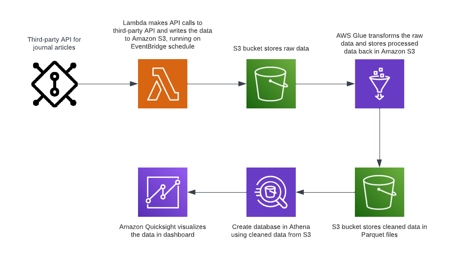

# Scientific Papers AWS ETL Pipeline

This project is an AWS ETL pipeline for cleaning and processing scientific papers from the medRxiv and bioRxiv repositories. The pipeline involves several steps:

1. **Data Extraction**: Extract scientific papers daily from the medRxiv and bioRxiv API endpoints into JSON files in S3 raw bucket using AWS Lambda and EventBridge. JSON files are crawled and queryable by AWS Glue and Athena.
2. **Data Transformation**: Clean the data from the raw bucket by combining bioRxiv and medRxiv data, removing null rows and duplicates, extracting keyword (CAR T) count and total word count, partitioning by year, month, day, and transforming the data into parquet format.
3. **Data Loading**: Load the transformed data into a new S3 cleaned bucket.
4. **Data Analysis**: Analyze the data using AWS Athena and QuickSight.

Below is a diagram of the ETL pipeline:

